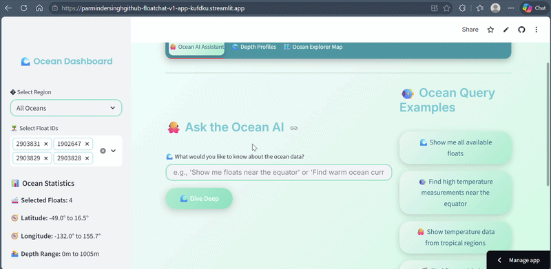

# FloatChat — ARGO Float Data Pipeline (Hackathon Prototype)

> This repository contains the initial prototype developed during an early hackathon phase to validate the core concept and architecture.

---

## 🚀 Live Demo

🌐 **Live App:** [Open FloatChat Demo](https://parmindersinghgithub-floatchat-v1-app-kufdku.streamlit.app/)

---

## 🎥 Demo Preview

<p align="center">
  
</p>

---

## 🌊 Overview

FloatChat is an interactive oceanographic analytics platform built around ARGO float datasets.

The project implements an end-to-end pipeline for:

- NetCDF ingestion
- SQLite storage
- Interactive visualizations
- Natural language querying

The prototype focuses on rapid experimentation and lightweight deployment while still supporting large-scale multi-float ingestion workflows.

---

## ✨ Key Highlights

- Interactive ARGO float trajectory visualization
- Natural language querying over oceanographic data
- NetCDF ingestion pipeline with SQLite backend
- Streamlit-powered analytics dashboard
- Multi-float diverse sampling support
- Interactive profile, map, and time-series visualizations
- Modular and extensible architecture
- Lightweight prototype optimized for rapid experimentation

---

## 📊 Dataset Scale

Current prototype supports:

- Multi-float ARGO trajectory ingestion
- Millions of measurement rows
- Diverse float sampling across datasets
- SQLite-backed interactive querying
- Configurable ingestion presets
- Large-scale ingestion experimentation

---

## 🏗️ Architecture

```text
NetCDF Files
      ↓
Data Ingestion Pipeline
      ↓
SQLite Database
      ↓
Query & Filtering Layer
      ↓
Visualizations + Chatbot Interface
      ↓
Interactive Streamlit Dashboard
```

---

## 📁 Project Structure

```text
project/
├── app.py                  # Main Streamlit application
├── data_ingestion.py       # NetCDF ingestion pipeline
├── db_utils.py             # SQLite database operations
├── visualization.py        # Plot and map generation
├── chatbot.py              # Natural language querying
├── config.py               # Centralized ingestion config
├── oceanic_theme.css       # Custom UI styling
├── requirements.txt        # Dependencies
├── demo.gif            # Demo preview
└── README.md
```

---

## 🚀 Features

### 🌐 Interactive Dashboard

- Streamlit-based multi-tab interface
- Real-time filtering and querying
- Interactive maps and profile views
- Responsive visual analytics

### 📥 Data Ingestion

- NetCDF file processing with xarray
- ARGO float metadata extraction
- Diverse float sampling support
- Configurable ingestion scaling
- Automatic sample generation for testing

### 🗄️ Database Layer

- SQLite-based lightweight storage
- Indexed query optimization
- Bounding-box and time-range filtering
- Efficient multi-float querying

### 📈 Visualization System

- Float trajectory maps
- Temperature/salinity profile plots
- Time-series analysis
- Depth heatmaps
- Statistical distributions

### 🤖 Natural Language Querying

Supports queries such as:

- "Show me floats near the equator"
- "Find high temperature measurements"
- "Show salinity data from the Pacific Ocean"
- "Find deep measurements greater than 1000m"

---

## 🛠️ Tech Stack

| Technology | Purpose |
|---|---|
| Python | Core application logic |
| Streamlit | Interactive dashboard |
| xarray / netCDF4 | Scientific data ingestion |
| pandas | Data manipulation |
| SQLite | Lightweight database |
| Plotly | Interactive charts |
| Folium | Interactive maps |
| NumPy | Scientific computing |

---

## 🔍 Example Queries

### Region Queries

- "Show me floats near the equator"
- "Find data from the Pacific Ocean"

### Parameter Queries

- "Find high temperature measurements"
- "Show low salinity data"

### Time Queries

- "Show data from 2023"
- "Find measurements from March"

### Combined Queries

- "Find high temperature measurements near the equator in 2023"

---

## ⚙️ Configuration System

The project includes a centralized ingestion configuration system via `config.py`.

Supported presets:

- SMALL_TEST
- MEDIUM_TEST
- LARGE_TEST

Features:

- Diverse float sampling
- Adjustable ingestion limits
- Configurable query scaling
- Runtime preset switching

---

## 📊 Performance

Current prototype demonstrates:

- Multi-million row ingestion support
- Real-time interactive querying
- Efficient SQLite-backed filtering
- Large-scale float diversity sampling
- Lightweight local deployment workflow

---

## 🚀 Quick Start

### 1. Clone Repository

```bash
git clone YOUR_REPO_LINK
cd YOUR_PROJECT_NAME
```

### 2. Install Dependencies

```bash
pip install -r requirements.txt
```

### 3. Run Application

```bash
streamlit run app.py
```

### 4. Open Browser

```text
http://localhost:8501
```

---

## 🧪 Testing

### Test Individual Components

```bash
python data_ingestion.py
python db_utils.py
python visualization.py
python chatbot.py
```

### Run Full Application

```bash
streamlit run app.py
```

---

## 🔮 Future Enhancements

### Scalability

- PostgreSQL/MySQL backend
- Parallel ingestion
- Real-time streaming
- Distributed processing

### AI & Analytics

- RAG-based querying
- LLM integration
- Semantic search
- Forecasting and anomaly detection

### Platform Features

- Multi-user collaboration
- Export functionality
- API endpoints
- Additional sensor integrations

---

## 🎯 Success Criteria Achieved

- ✅ End-to-end data pipeline
- ✅ Interactive visual analytics
- ✅ Natural language querying
- ✅ Multi-float ingestion support
- ✅ Configurable scaling system
- ✅ Modular architecture
- ✅ Lightweight deployment workflow
- ✅ Ready for demonstration and experimentation

---

## 📝 Notes

- This repository is an early-stage prototype / proof-of-concept.
- The architecture prioritizes experimentation and modularity over production hardening.
- Large ingestion modes may require substantial RAM and storage depending on dataset scale.

---

## 📄 License

This project is licensed under the MIT License.
